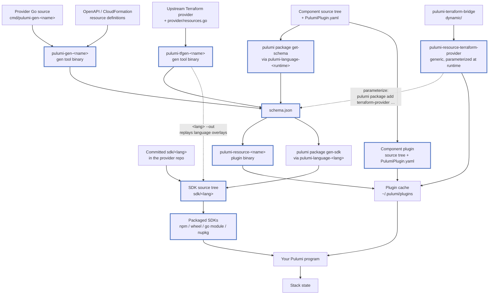
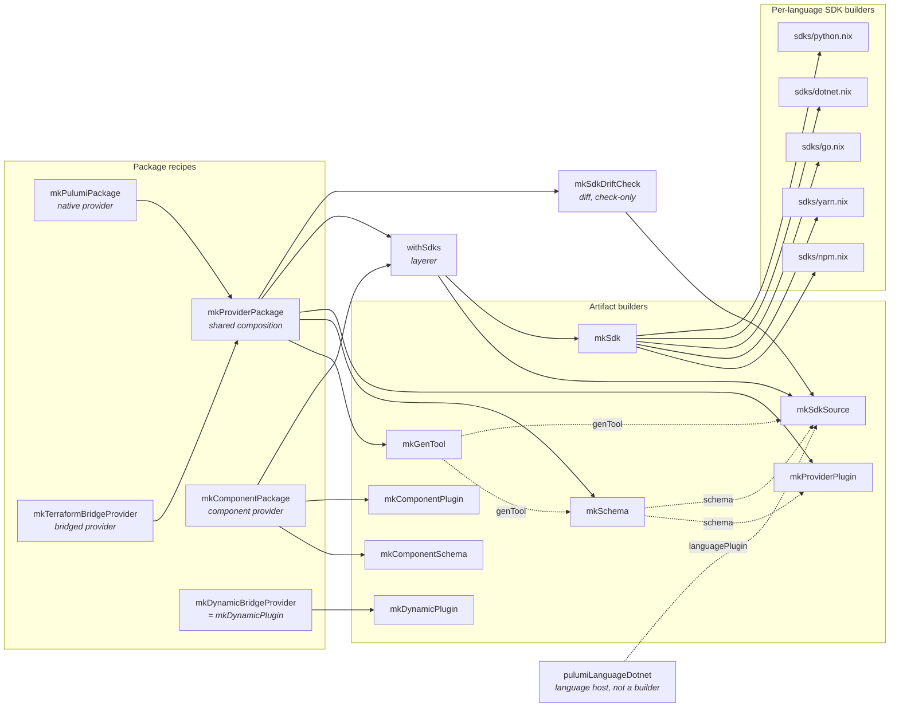

# Architecture

## Pulumi's artifacts

Every Pulumi provider, whatever it is generated from, converges on one artifact: a [package schema](https://www.pulumi.com/docs/iac/guides/building-extending/packages/schema/), `schema.json`.
The plugin binary and every language SDK are downstream of it, which is why each builder here separates schema extraction from packaging.

Thick-bordered nodes are the artifacts pulumi2nix builds, and each has exactly one builder.

Three things in that graph are worth naming, because they are what the builder set has to model.
`schema.json` has two producers: a *compiled gen tool* for native and ahead-of-time-bridged providers, versus [`pulumi package get-schema`](https://www.pulumi.com/docs/iac/cli/commands/pulumi_package_get-schema/) launching the component's own language host to serve `GetSchema` straight from source.
An *SDK source tree* has three: codegen from the schema, the tree the upstream repo commits, and the gen tool emitting one directly, which is the only route that replays tfgen's per-language overlays.
And the dynamic bridge is a sibling rather than a child of the chain, since it takes its Terraform provider at runtime instead of being generated against one ahead of time.

A [component](https://www.pulumi.com/docs/iac/concepts/resources/components/) package has no compiled resource binary at all: the source tree plus its `PulumiPlugin.yaml` *is* the plugin.

## The builders

One builder per artifact. Each builds a single derivation and composes nothing.

| Artifact | Builder |
| --- | --- |
| gen tool binary | [`mkGenTool`](usage.md#mkgentool) |
| `schema.json`, from a gen tool | [`mkSchema`](usage.md#mkschema) |
| `schema.json`, from component source | [`mkComponentSchema`](usage.md#mkcomponentschema) |
| `pulumi-resource-<name>` binary | [`mkProviderPlugin`](usage.md#mkproviderplugin) |
| component plugin tree | [`mkComponentPlugin`](usage.md#mkcomponentplugin) |
| `pulumi-resource-terraform-provider` | [`mkDynamicPlugin`](usage.md#mkdynamicplugin) |
| one SDK source tree | [`mkSdkSource`](usage.md#mksdksource) |
| one packaged SDK | [`mkSdk`](usage.md#mksdk) |

Where an artifact has more than one producer, the producer is an *argument*, not another builder: `mkSdkSource` takes `src`, `schema` or `genTool`, and picks its route from which one it was given.

The recipes compose those builders into a whole package. They are convenience, not artifacts, and none of them calls another.

`mkDynamicPlugin` stands alone: it builds one generic binary, so it has no schema step and no SDKs, and its recipe is the builder itself.

Several small helpers are shared by nearly every builder and are left out above to keep the graph readable: `fetchProviderSource` (the default `owner`/`repo`/`rev`/`hash` fetch), `srcName` (resolving `sourceRoot` from any `src`), `narrowSdkSrc` ([narrowed SDK sources](sdks.md#narrowed-sdk-sources), used by `mkSdkSource`'s committed route), and `langArgNames` (picking `<lang>Args` out of the caller's arguments).

## Deviations from Pulumi's graph

The builder graph should be the artifact graph, one derivation per node.
Where the two disagree, the difference is a cost, not a design: it means a node exists twice, or an edge skips the node it should pass through, and both make the library harder to reason about than Pulumi itself.

One deviation is left, and it is kept on purpose.

| Deviation | Why it is kept |
| --- | --- |
| `mkSdkSource`'s committed route reads a tree the upstream repo already ships at `sdk/<lang>`, rather than deriving it from `schema.json`. | Upstream repos commit those trees, and tfgen's language overlays cannot be recovered from a schema. [`sdks.<lang>.generate`](sdks.md#generated-sdks-for-bridged-providers) is the aligned path for providers that do not need them, and [`sdkDrift`](sdks.md#sdk-drift-checks) is the compensation for those that do. It is a producer of a modelled node, not an edge around one. |

Two more are upstream's rather than this library's, and cannot be closed here.
`mkSdkSource` takes a caller-supplied `go.mod`/`go.sum` because [`gen-sdk`](https://www.pulumi.com/docs/iac/cli/commands/pulumi_package_gen-sdk/) emits no module files, and [`pulumiLanguageDotnet`](https://github.com/pulumi/pulumi-dotnet) is patched to read an offline logo because codegen otherwise reaches the network mid-build.
The .NET one could at least be narrowed by taking a caller-supplied logo derivation, so a real `logoUrl` can be fetched by hash rather than replaced with the generic icon.

### Closed

For the record, since the shape of the library is easier to read against what it used to be:

| Was | Closed by |
| --- | --- |
| `schema.json` was built twice per bridged provider: once as `passthru.schema`, once again by a gen tool run inside the plugin build's `postConfigure`. | `mkProviderPlugin` takes a `schema` derivation and plants it at `provider/cmd/<cmdRes>/schema.json`, where the repo's `generate.go` reads it. The gen tool is no longer an input to the plugin build at all. |
| The gen tool binary had no builder, and two near-identical `buildGoModule` calls built it inline. | `mkGenTool`, taken as an input by `mkSchema` and by `mkSdkSource`'s gen-tool route. |
| `mkPulumiPackage` was `mkTerraformBridgeProvider` with `passthru.schema` swapped out, so the native path was a child of the bridged one, and a generated SDK under it codegened from the *bridge's* schema. | Both are presets over `mkProviderPackage`, differing only in `schemaCommand` and `embedSchema`. Each composes its own schema, and its SDKs descend from that one. |
| `mkPulumiPackage` required every caller to pass a `postConfigure`, because it inherited tfgen's conventions. | Gone. A `pulumi-go-provider` provider serves its schema from Go structs and embeds nothing, so the native preset plants no schema and runs no `go generate`; `embedSchema = true` is there for a native provider that does embed one. |
| Python bypassed `mkSdk` and the `lib/sdks` registry, built in place by the bridge builder and attached straight to `passthru.sdks.python`. It was also the one language built unconditionally. | `lib/sdks/python.nix`, registered like every other language and opt-in like every other language. This also gives component providers a python SDK, which they previously could not have. |
| `mkSdkDriftCheck` ran `${cmdGen} <lang> --out` itself, an SDK-from-gen-tool edge that skipped the schema node. | That edge is real in Pulumi's graph, so it is modelled: it is one of `mkSdkSource`'s three producers. The check builds nothing now, and is a `diff` of two SDK source trees. |
| Two layerers, `withSdks` and `withGeneratedSdks`, differing only in where an SDK's source came from, plus an `attachSdks` helper so they could chain. | One `withSdks`. The per-language `generate` flag picks a `mkSdkSource` producer, so one provider can still commit some SDKs and generate others. |
