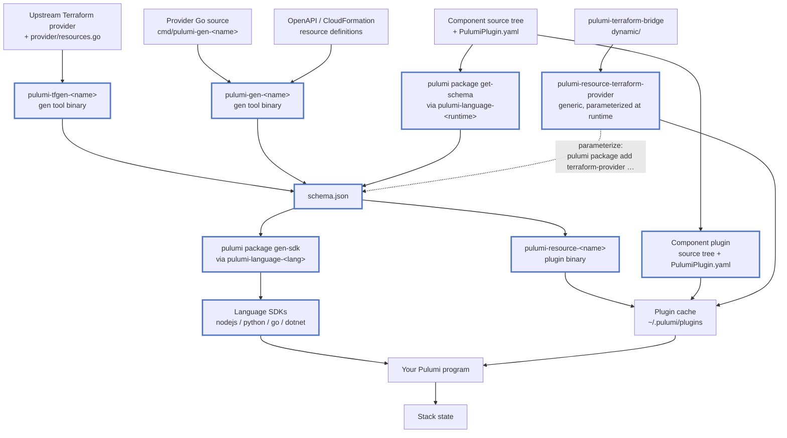
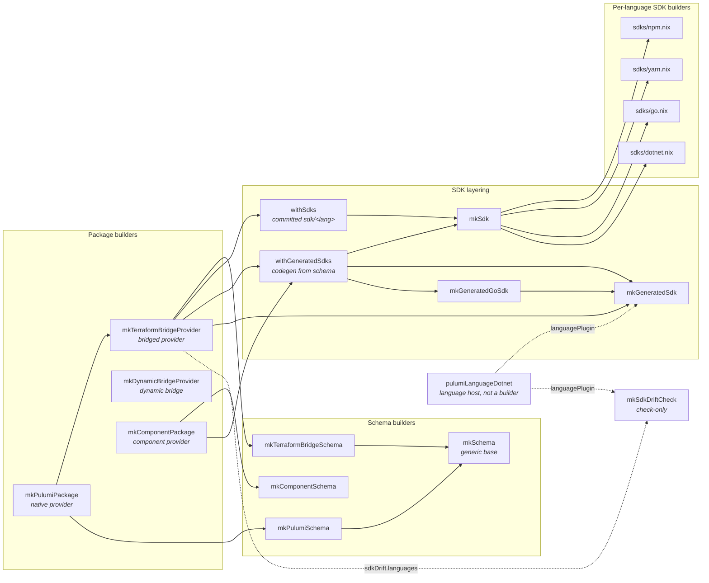

# Architecture

## Pulumi's artifacts

Every Pulumi provider, whatever it is generated from, converges on one artifact: `schema.json`.
The plugin binary and every language SDK are downstream of it, which is why each builder here separates schema extraction from packaging.

Thick-bordered nodes are the artifacts pulumi2nix builds.
Note the two routes into `schema.json`: a *compiled gen tool* for native and ahead-of-time-bridged providers, versus `pulumi package get-schema` launching the component's own language host to serve `GetSchema` straight from source.
The dynamic bridge is a sibling rather than a child of that chain, since it takes its Terraform provider at runtime instead of being generated against one ahead of time.
A component package has no compiled resource binary at all: the source tree plus its `PulumiPlugin.yaml` *is* the plugin.

## The builders

Every builder below is reachable from `pulumi2nix.lib`, `overlays.default`, or the flake module.
Arrows read "is built from".

`mkDynamicBridgeProvider` stands alone: it builds one generic binary, so it has no schema step and no SDKs.

The two layerers differ in where an SDK's *source* comes from.
`withSdks` reads the tree the upstream repo already commits at `sdk/<lang>`; `withGeneratedSdks` runs codegen against `schema.json` instead.
`mkTerraformBridgeProvider` chains both, deciding per language from `sdks.<lang>.generate`, so one provider can commit some SDKs and generate others.
`mkComponentPackage` only ever generates, since a component provider has no committed SDK tree.

Several small helpers are shared by nearly every builder and are left out above to keep the graph readable: `fetchProviderSource` (the default `owner`/`repo`/`rev`/`hash` fetch), `srcName` (resolving `sourceRoot` from any `src`), `narrowSdkSrc` ([narrowed SDK sources](sdks.md#narrowed-sdk-sources)), `langArgNames` (picking `<lang>Args` out of the caller's arguments), and `attachSdks` (merging built SDKs onto `passthru.sdks` so the two layerers chain rather than overwrite).

## Deviations from Pulumi's graph

The builder graph should be the artifact graph, one derivation per node.
Where the two diagrams disagree, the difference is a cost, not a design: it means a node exists twice, or an edge skips the node it should pass through, and both make the library harder to reason about than Pulumi itself.
The current deviations, and what closing each one takes:

| Deviation | Why it is there | Closing it |
| --- | --- | --- |
| `schema.json` is built twice for one provider: once as `passthru.schema`, and again inside the provider build, whose `postConfigure` re-runs `${cmdGen} schema` before `go generate` (`lib/mk-terraform-bridge-provider.nix:211`). | The `go generate` step embeds the schema from the repo's own path, and the build has a gen tool on hand already. | Copy the already-built `passthru.schema` into that path instead of regenerating it, after confirming tfgen's `schema` subcommand has no other in-tree side effect the build depends on. |
| `mkPulumiPackage` is `mkTerraformBridgeProvider` with `passthru.schema` swapped out (`lib/mk-pulumi-package.nix:19`), so the native path is a child of the bridged one rather than its sibling. | Both build a Go binary out of `provider/` and layer the same SDKs, and the bridge builder got there first. | Hoist `mkBasePackage` and the SDK layering into a base both call. Until then the native path inherits tfgen's conventions, which is what forces `mkPulumiPackage`'s `postConfigure` guard. |
| Under `mkPulumiPackage`, a *generated* SDK codegens from `mkTerraformBridgeSchema`, not from the `mkPulumiSchema` that the same package exposes as `passthru.schema`. | Follows from the delegation above: the swap happens after `withGeneratedSdks` has already been handed the bridge's schema. | Same fix. No example sets `sdks.<lang>.generate` on a native provider, so this path is currently unexercised rather than known-good. |
| Python bypasses `mkSdk` and the `lib/sdks` registry entirely, built in place by `mkPythonPackage` and attached straight to `passthru.sdks.python` (`lib/mk-terraform-bridge-provider.nix:218`). It is also the one language built unconditionally. | The version and `pkg_resources` patching it carries has no equivalent in the other builders. | Register `lib/sdks/python.nix` and route it through `mkSdk` like every other language, which also closes [component providers' missing python SDK](../TODO.md#python-sdks-for-component-providers). |
| `mkSdkDriftCheck` diffs the committed tree against `${cmdGen} <lang> --out` (`lib/mk-sdk-drift-check.nix:86`), an SDK-from-gen-tool edge that skips the schema node. | It predates the generation path, and on a pre-delegation bridge `cmdGen <lang>` is genuinely a different generator from `gen-sdk`. | Diff against `mkGeneratedSdk` output instead, reusing a builder that already exists. Blocked for providers shipping tfgen [language overlays](../TODO.md#generated-bridged-sdks-do-not-get-tfgens-language-overlays), whose committed SDK is by definition not reproducible from the schema. |

`withSdks` reading a committed `sdk/<lang>` is the largest departure from the diagram above, where every SDK descends from `schema.json`, and it is the one deviation kept on purpose: upstream repos commit those trees, and tfgen's language overlays cannot be recovered from a schema.
[`sdks.<lang>.generate`](sdks.md#generated-sdks-for-bridged-providers) is the aligned path for providers that do not need them, and [`sdkDrift`](sdks.md#sdk-drift-checks) is the compensation for those that do.

Two more deviations are upstream's rather than this library's, and cannot be closed here: `mkGeneratedGoSdk` exists only because `gen-sdk` emits no `go.mod`/`go.sum`, and `pulumiLanguageDotnet` is patched to read an offline logo because codegen otherwise reaches the network mid-build.
The .NET one could at least be narrowed by taking a caller-supplied logo derivation, so a real `logoUrl` can be fetched by hash rather than replaced with the generic icon.
